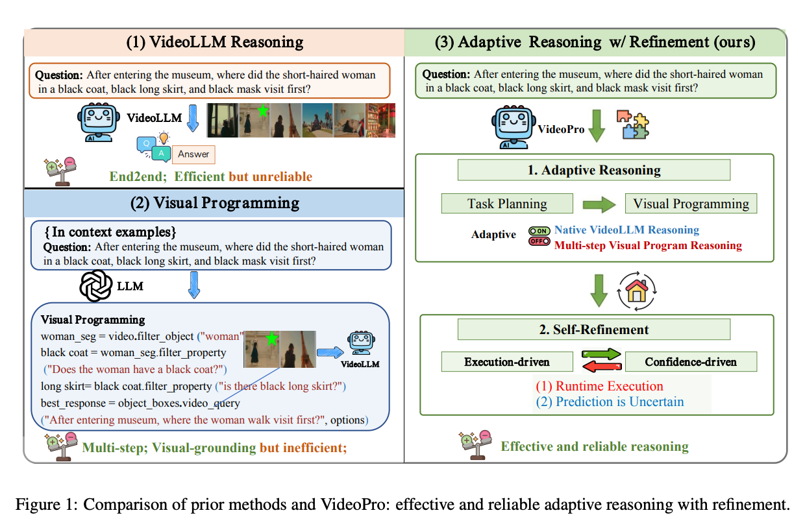
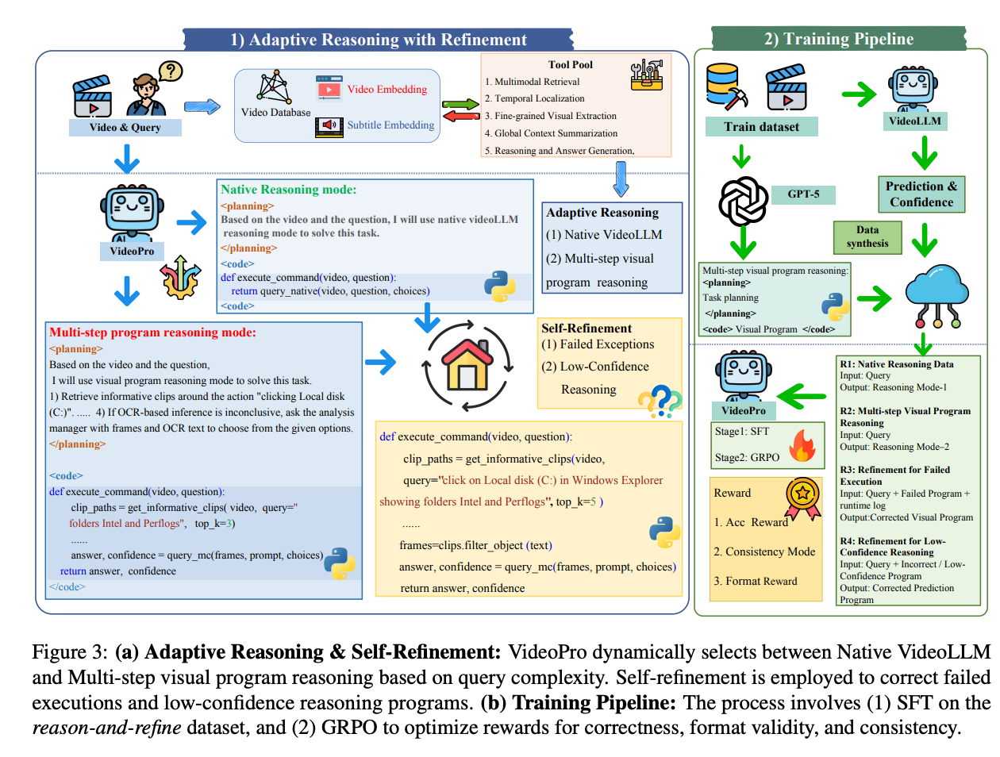
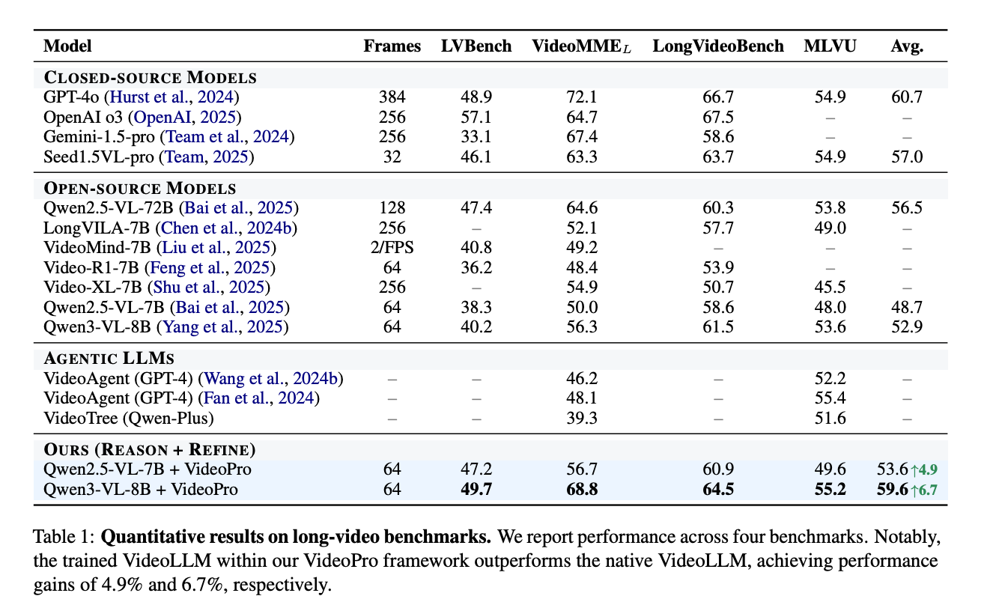

<div align="center">
    <h1 align="center">VideoPro: Adaptive Program Reasoning for Long Video Understanding
    </h1>

<a href="https://arxiv.org/abs/2509.17743">
</a>

<!-- <a href="https://lichenglin.github.io/VideoPro/">
</a> -->

[](https://huggingface.co/zapqqqwe/videopro_grpo)
<!-- [](https://huggingface.co/datasets/lichenglin/VideoPro) -->

</div>


## 🔥 News
- [2026/04/12] 🔥🔥 We release the code, model, and dataset of **VideoPro**!


## Introduction

We propose <b>VideoPro</b>, a unified framework for long-video understanding with <b>adaptive reasoning</b> and <b>self-refinement</b>. Long-video understanding is difficult because query-relevant evidence is often sparse and distributed across distant temporal segments. VideoPro addresses this with a coarse-to-fine analysis pipeline that dynamically routes each query to either native VideoLLM reasoning or multi-step visual program reasoning, and performs self-refinement when execution fails or prediction confidence is low.



### ✨ Highlights:

- **Adaptive Query-level Routing**: Dynamically routes each query to either native VideoLLM reasoning (for simple or high-confidence questions) or multi-step visual program reasoning (for complex long-range queries), rather than applying a one-size-fits-all strategy.

- **Executable Visual Programs**: The model generates and executes structured Python programs using a rich video module library, enabling precise temporal grounding and fine-grained visual analysis across long videos.

- **Three-Mode Self-Refinement**:
  - *Native refinement*: refines low-confidence direct answers from native VideoLLM
  - *Bug fix*: fixes failed programs using runtime error logs
  - *Program refinement*: improves low-confidence program reasoning outputs

- **General Video Module Library**: A rich set of callable APIs available within visual programs, including multimodal retrieval, temporal localization (`trim_frames`, `trim_around`, `trim_before`, `trim_after`), object detection (`detect_object`), frame extraction (`extract_frames`), subtitle-based retrieval (`get_subtitle_hints`), and multi-choice QA (`query_mc`, `query_native`, `query_frames`).

- **Two-Stage Training**: Stage 1 — Supervised Fine-Tuning (SFT) samples; Stage 2 — Group Relative Policy Optimization (GRPO) samples covering refinement modes.






## 🔥 Set Up Environment
```bash
conda create -n videopro python=3.10 -y
conda activate videopro
pip install -r requirements.txt
pip install flash_attn==2.8.3 --no-build-isolation
```


## 🔧 Model and Dataset Preparation

#### 1. Model Download
```bash
huggingface-cli download --resume-download zapqqqwe/videopro_grpo --local-dir ./models/videopro
```

#### 2. Dataset

The dataset includes:
- `dataset/train_sft.jsonl` — SFT training data (7,489 program reasoning samples)
- `dataset/train_grpo.jsonl` — GRPO training data (6,009 samples across three refinement modes):
  - 4,554 low-confidence native answer refinement samples
  - 580 buggy program fix samples
  - 875 low-confidence program refinement samples


## 🚀 Inference

#### Step 1: Deploy the Model
```bash
TORCH_SYMM_MEM_DISABLE_MULTICAST=1 \
CUDA_VISIBLE_DEVICES=0,1,2,3 \
FPS_MAX_FRAMES=64 \
VIDEO_MAX_PIXELS=50176 \
swift deploy \
    --model ./models/videopro \
    --infer_backend vllm \
    --torch_dtype bfloat16 \
    --port 8007 \
    --vllm_tensor_parallel_size 4 \
    --served_model_name "qwen3vl"
```

#### Step 2: Generate Visual Program

Given a video and a multiple-choice question, the model first plans whether to use native mode or visual program mode, then generates an executable `execute_command` function:

```python
from src.generate_code import infer_video_mcq

result = infer_video_mcq(
    video_path="/path/to/video.mp4",
    question="What is the person doing in the video?",
    options=["Cooking in the kitchen", "Playing guitar", "Riding a bicycle", "Swimming in a pool"],
)
# result["output_text"] contains <planning>...</planning><code>...</code>
```

The model outputs a structured response:
```
<planning>
  Judge whether native VideoLLM or visual program reasoning is appropriate.
</planning>

<code>
def execute_command(video_path, question, choices, duration):
    # Visual program using the module library APIs
    ...
    return answer
</code>
```

#### Step 3: Execute Visual Program

The generated `execute_command` function is executed within a runtime environment that exposes the full video module library:

```python
from src.execute_code import safe_run_execute_command

output = safe_run_execute_command(
    code_string=result["output_text"],
    video_path="/path/to/video.mp4",
    question="What is the person doing in the video?",
    choices=["Cooking in the kitchen", "Playing guitar", "Riding a bicycle", "Swimming in a pool"],
    duration=120,
    clip_save_folder="./clips",
    clip_duration=10,
    workers=8,
)
# output["success"], output["result"], output["error"], output["traceback"]
```

#### Step 4: Self-Refinement (if needed)

If the program fails or returns a low-confidence answer, trigger self-refinement. Three refinement modes are supported automatically based on the input:

```python
from src.refine_code import refine_code

# Mode 1: native refinement (when current_code uses query_native)
# Mode 2: bug fix (when error_log is provided)
# Mode 3: general program refinement (otherwise)
result = refine_code(
    video_path="/path/to/video.mp4",
    question="What is the person doing in the video?",
    choices=["Cooking in the kitchen", "Playing guitar", "Riding a bicycle", "Swimming in a pool"],
    current_code=output["processed_code"],
    error_log=output["traceback"],  # pass None if no error
)
# result["refined_code"], result["prompt_type"]
```


## 📑 Video Module Library

The following APIs are available inside the generated `execute_command` function:

| API | Description |
|---|---|
| `query_native(video_path, question, choices)` | Direct VideoLLM answer with confidence score |
| `query_mc(frames, question, choices)` | Multi-choice QA over a list of frames |
| `query_frames(frames, question)` | Open-ended QA over a list of frames |
| `query_yn(frames, question)` | Yes/No QA over a list of frames |
| `get_informative_clips(video_path, query, top_k)` | Retrieve top-k semantically relevant video clips |
| `extract_frames(video_path, num_frames)` | Uniformly sample frames from a video |
| `trim_frames(video_path, start, end)` | Extract frames from a specific time range |
| `trim_around(video_path, timestamp, intervals)` | Extract frames around a timestamp |
| `trim_before(video_path, timestamp, intervals)` | Extract frames before a timestamp |
| `trim_after(video_path, timestamp, intervals)` | Extract frames after a timestamp |
| `detect_object(frame, text)` | Detect objects in a frame with Grounding DINO |
| `get_subtitle_hints(video_path, question, choices, duration)` | Retrieve and summarize relevant subtitles |
| `crop(frame, box)` / `crop_left/right/top/bottom(frame)` | Spatial cropping of a frame |


## 💻 Training

#### Stage 1: Supervised Fine-Tuning (SFT)
```bash
FPS_MAX_FRAMES=64 VIDEO_MAX_PIXELS=50176 \
export NPROC_PER_NODE=8
CUDA_VISIBLE_DEVICES=0,1,2,3,4,5,6,7 \
swift sft \
    --model ./models/videopro \
    --train_type lora \
    --dataset dataset/train_sft.jsonl \
    --load_from_cache_file true \
    --torch_dtype bfloat16 \
    --num_train_epochs 1 \
    --per_device_train_batch_size 2 \
    --per_device_eval_batch_size 1 \
    --learning_rate 1e-4 \
    --lora_rank 64 \
    --lora_alpha 16 \
    --freeze_vit True \
    --target_modules all-linear \
    --gradient_accumulation_steps 1 \
    --eval_steps 50 \
    --save_steps 900 \
    --save_total_limit 5 \
    --logging_steps 5 \
    --output_dir ./models/sft \
    --warmup_ratio 0.05 \
    --dataloader_num_workers 8 \
    --use_chat_template False \
    --max_length 200000
```

#### Stage 2: Group Relative Policy Optimization (GRPO)
```bash
FPS_MAX_FRAMES=64 \
VIDEO_MAX_PIXELS=50176 \
CUDA_VISIBLE_DEVICES=4,5,6,7 \
NPROC_PER_NODE=4 \
swift rlhf \
    --rlhf_type grpo \
    --model ./models/sft/checkpoint-merged \
    --train_type lora \
    --use_vllm true \
    --vllm_mode colocate \
    --vllm_gpu_memory_utilization 0.75 \
    --vllm_tensor_parallel_size 4 \
    --dataset dataset/train_grpo.jsonl \
    --torch_dtype bfloat16 \
    --num_train_epochs 1 \
    --per_device_train_batch_size 1 \
    --per_device_eval_batch_size 1 \
    --gradient_accumulation_steps 2 \
    --eval_steps 1000 \
    --save_steps 500 \
    --learning_rate 1e-6 \
    --save_total_limit 5 \
    --logging_steps 5 \
    --output_dir ./models/grpo \
    --warmup_ratio 0.05 \
    --dataloader_num_workers 4 \
    --max_completion_length 4096 \
    --reward_funcs coderm \
    --external_plugins plugin.py \
    --num_generations 8 \
    --temperature 1.0 \
    --log_completions true \
    --async_generate false \
    --move_model_batches 16 \
    --offload_optimizer true \
    --offload_model true \
    --sleep_level 0
```


## 📧 Contact
If you have any comments or questions, please open a new issue or feel free to contact [Chenglin Li](https://scholar.google.com/citations?user=7LlS58IAAAAJ&hl=zh-CN).


## ⭐ Citation
```bibtex
@article{videopro,
  title={VideoPro: Adaptive Program Reasoning for Long Video Understanding},
  author={Li, Chenglin and others},
  journal={arXiv preprint arXiv:2509.17743},
  year={2025}
}
```
